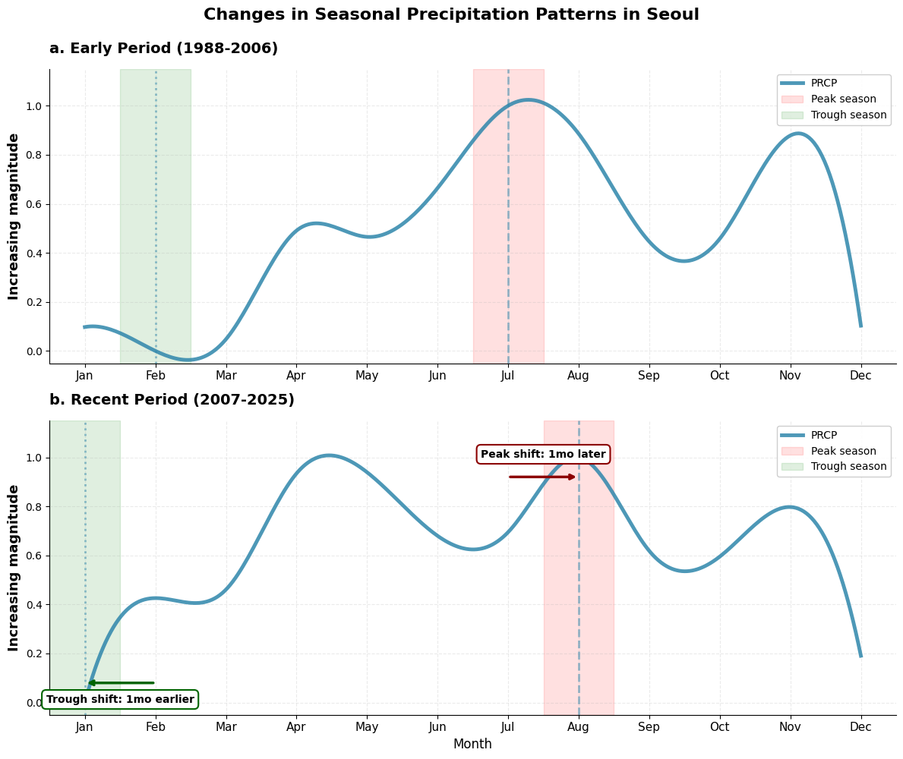
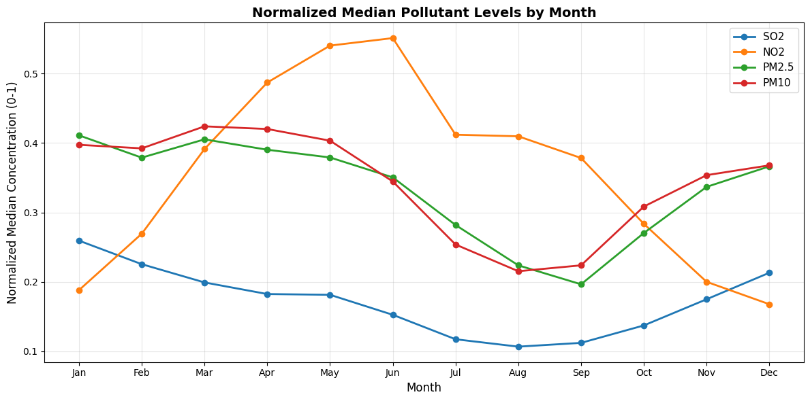
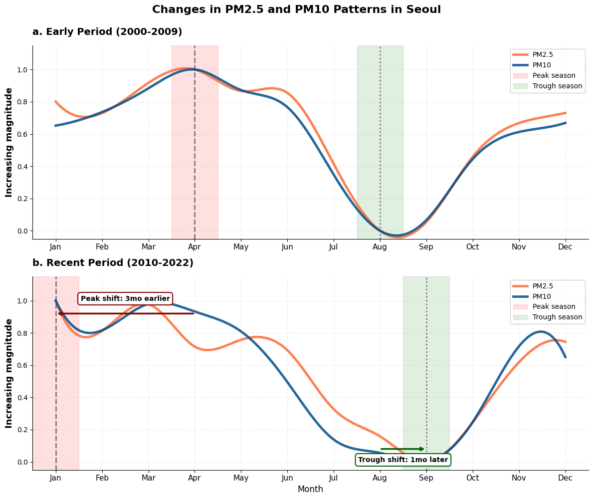

# Monsoons & Air Quality in Seoul, South Korea

## Background

In the fall of my freshman year, I took Historical Climatology (ENVS 0070G) with Dr. Gavin Piccione. In this class, we learned about using time-series analysis to understand historical climate trends via proxy measurements. At the end of the semester, we all developed our own historical climate research project. I was particularly interested in how climate change influenced the monsoons in Seoul, South Korea, and its resulting impact on air quality.
 
## Monsoon Timing Shifts

I first wanted to establish that the monsoon season was changing in Seoul, South Korea. Using precipitation data from NOAA spanning 1988–2024, I found that peak monsoon rainfall had shifted **1 month later** — from July in the early period (1988–2006) to August in the recent period (2007–2024). The trough also shifted 1 month earlier, from February to January. Together, these changes suggest the monsoon transition period has grown longer, with meaningful consequences for how long pollutants can accumulate in the atmosphere before the summer rains wash them out.

## Air Pollutant Seasonality

To understand what this meant for air quality, I analyzed Seoul Open Data Plaza records for four major pollutants — PM2.5, PM10, SO₂, and NO₂ — over the same period. All four showed significant seasonality, with particulate matter generally peaking in late winter or spring and dipping during the monsoon season, when wet deposition removes particles from the air.

## Shifts in Particulate Matter

The most striking result was in PM2.5 and PM10: their peak concentrations shifted **3 months earlier**, from April in the early period (2000–2009) to January in the recent period (2010–2023). The trough month shifted 1 month later, from August to September — consistent with the delayed monsoon cleansing effect. SO₂ and NO₂ showed no significant timing shifts, suggesting their seasonal patterns are governed more by stable emission sources than by monsoon dynamics.

## Cumulative Exposure

To quantify how much more pollution exposure resulted from this shift, I computed the area under the curve (AUC) from peak to trough for each period using the trapezoidal rule. **PM2.5 cumulative exposure increased by 50.7%** between periods (AUC: 117.66 → 177.34, p < 0.001, 95% CI: [47.89, 71.35]), while PM10 showed no significant change (−1.9%, 95% CI: [−23.42, 14.06]). The divergence between the two pollutants points to different drivers: PM2.5, largely from combustion and secondary aerosol formation, appears more sensitive to shifting atmospheric stagnation patterns in winter, while coarser PM10 is more influenced by year-round mechanical sources like road dust.
 
## Public Health Implications

The public health implications are significant. Seoul's nearly 10 million residents now face their highest PM2.5 exposure in January — coinciding with respiratory infection season, when cold and flu already strain the immune system. The later monsoon trough means that elevated particulate levels persist from winter through late summer, effectively extending the high-exposure window to roughly nine months of the year.

## Methods
 
This project involved building a full analysis pipeline in Python: data cleaning with IQR-based outlier removal and min-max normalization, cubic spline interpolation for seasonal pattern visualization, Spearman correlation for trend detection, paired statistical tests (Wilcoxon signed-rank and t-test with Shapiro-Wilk normality checks), Mann-Whitney U tests for month-by-month comparisons, and 10,000-iteration bootstrap resampling to construct confidence intervals for AUC differences.

## Presentation

I shared an oral presentation on this project as my final presentation for my ENVS 0070G class at the end of Fall 2025. I also had the opportunity to present my research by [postering](diveposter.pdf) at Brown University's annual DEEPS Dive Research Symposium.

## [License](LICENSE)